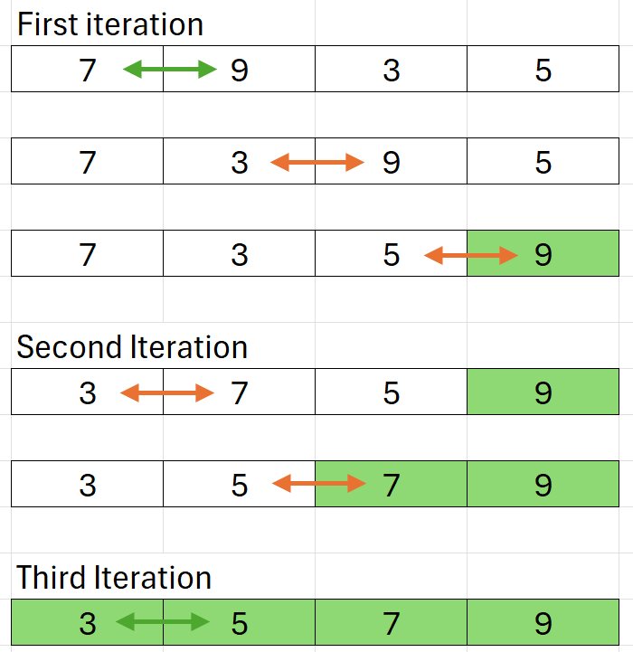

# Interview Prep - C++

## General
- Memory Allocation (stack, static, heap) 
- Heap vs Stack 
- Big O Notation
- Bit Manipulation

## Data Structures 
- Arrays
- Stacks
- Linked List/ Doubly Linked List
- Queues
- Binary Trees 
- Graphs
- Ring/ Circular Buffer 
- Hash Maps


### Arrays

#### C-Style Arrays 
--- 
- Fixed size defined at compile time 
- Syntax `int myArray[10]` or `int* myArray = new int[10]`

```
int main() 
{
    // Allocated on stack and automatically destroyed when it goes out of scope.
    int myArray1[10];

    // Allocated on heap must be explicitly freed, will NOT be automatically destroyed when going out of scope.
    int* myArray2 = new int[10];

    delete[] myArray2;
}

```
---
---  

#### std::array `C++ Standard Library, Fixed Size Array`
---
- Fixed size array 
```
std::array<int, 5> numbers = {1, 2, 3, 4, 5};
```
---
---
#### std::vector\<T>  `C++ Stanard Library, Dynamic Array`
--- 
- Template class, dynamic array is automatiocally resized (very almost as fast as C-Style arrays)
- Supports move semantics

```
    // Vector declaration - Can be initialised inline using an initialiser list (by enclosing values in {})
    std::vector<int> myVector1 = {1, 2, 3};
    std::vector<int> myVector2;

    // Example of move semantics
    myVector2 = std::move(myVector1);
```

#### Hash Maps
Associative container that stores elements with a key-value relationship. 

---
#### std::unordered_map `C++ Stanard Library, Hash Map`
---

---
--- 

## Stacks 

### Stack implementation C++

```
// Example of Stack using Linked List (redacted)

#pragma once
#include "LinkedList.h"

template <class T>
class Stack
{
public:
	T Pop();
	void Push(T data);
	T& Peek();
	bool IsEmpty() { return m_data.IsEmpty(); }

private:
	LinkedList<T> m_data;
};

template<class T>
inline T Stack<T>::Pop()
{
	if (m_data.IsEmpty())
	{
        throw std::out_of_range("Stack is empty. Cannot pop.");
	}

	return m_data.PopBack();
}

template<class T>
inline void Stack<T>::Push(T data)
{
	m_data.PushBack(data);
}

template<class T>
inline T& Stack<T>::Peek()
{
	if (m_data.IsEmpty())
	{
		throw std::out_of_range("Stack is empty. Cannot peek.");
	}

	return m_data.PeekBack();
}
```

### Singly/ Doubly Linked List 
A linked list is a data structure whereby nodes in the structure reference the next node in the sequence or in the case of a doubly linked list they reference both the next and previous nodes.

#### Example of doubly linked list

```
#pragma once

template <class T>
class LinkedList
{
    class Node
    {
        friend class LinkedList;
        Node() = delete;
        Node(T data) : m_data(data) {}
        Node* m_next = nullptr;
        Node* m_prev = nullptr;
        T m_data;
    };

public:
    virtual ~LinkedList();
    void PushBack(T data);
    T PopBack();
    T PopFront();
    T& PeekFront();
    T& PeekBack();
    bool IsEmpty() { return m_head == nullptr; }

private: 
    Node* m_head = nullptr;
	Node* m_tail = nullptr;

};

template<class T>
inline LinkedList<T>::~LinkedList()
{
    while (!IsEmpty())
    {
		PopBack();
	}
}

template<class T>
inline void LinkedList<T>::PushBack(T data)
{
    Node* newNode = new Node(data);

    if (m_head == nullptr)
    {
        m_head = newNode;
        m_tail = m_head;
        return;
    }

    m_tail->m_next = newNode;
    newNode->m_prev = m_tail;
    m_tail = newNode;
}

template<class T>
inline T LinkedList<T>::PopBack()
{
    if (m_tail == nullptr)
    {
        throw std::out_of_range("List is empty. Cannot pop back.");
	}

    T value = m_tail->m_data;
	Node* temp = m_tail;
	m_tail = m_tail->m_prev;

    if (m_tail != nullptr)
    {
        m_tail->m_next = nullptr;

        if (m_tail->m_prev == nullptr)
        {
            m_head = m_tail;
        }
    }
    else
    {
		m_head = nullptr;
    }

	delete temp;
    return value;
}

template<class T>
inline T LinkedList<T>::PopFront()
{
    if (m_head == nullptr)
    {
        throw std::out_of_range("List is empty. Cannot pop front.");
	}

    T value = m_head->m_data;
	Node* temp = m_head;
	m_head = m_head->m_next;
    
    if (m_head != nullptr)
    {
		m_head->m_prev = nullptr;

        if (m_head->m_next == nullptr)
        {
			m_tail = m_head;
		}
	}
    else
    {
		m_tail = nullptr;
	}

	delete temp;
    return value;
}

template<class T>
inline T& LinkedList<T>::PeekFront()
{
    if (m_head == nullptr)
    {
        throw std::out_of_range("List is empty. Cannot peek.");
    }

    return m_head->m_data;
}

template<class T>
inline T& LinkedList<T>::PeekBack()
{
    if (m_tail == nullptr)
    {
        throw std::out_of_range("List is empty. Cannot peek.");
    }

    return m_tail->m_data;
}

```

## Algorithms 

### Sorting 
- Bubble sort
- Quick sort

#### Bubble Sort 
Bubble sort works by iterating over the elements and swapping them if the value on the left should be on the right in the case of intergers this would be if the left value is larger than the right value. After 1 iteration the right most/ last element in the list will be in the correct position, meaning with each iteration we iterate over n - 1 elements.

Worst Case Complexity: O(n^2), 

#### Diagram - Orange arrows show where a swap has occured.


#### Code Example:
```
void BubbleSort(int* elements, int numElements)
{
    int p = numElements;

    while (p > 0)
    {
        for (int i = 0; i < p -1; i++)
        {
            if (elements[i] > elements[i + 1])
            {
                int temp = elements[i];
                elements[i] = elements[i + 1];
                elements[i + 1] = temp;
            }
        }

        p--;
    }
}
```

#### Quick Sort
Quick sort is a recursive algorithm that works by taking the end value in a sequence and working out values left and right of this value which effectively works out the end values position within a sequence, it does the same for the values left and right of this value recursively, with each subsequent iteration the end values position in the sequence will be identified until all values are in the correct position in the sequence. 

```
void QuickSort(int* elements, int start, int end)
{
    if (end - start <= 0)
    {
		return;
	}

    int i = start;
    int j = start - 1;
    int pivot = elements[end];
    int temp;

    while (i < end)
    {
        if (elements[i] < pivot)
        {
            j++;
            temp = elements[j];
            elements[j] = elements[i];
            elements[i] = temp;
		}

        i++;
    }

    j++;
    temp = elements[j];
    elements[j] = pivot;
    elements[end] = temp;

    QuickSort(elements, start, j - 1);
    QuickSort(elements, j + 1, end);
}
```

### Searching
- Depth/ Bredth First Search

### Path Finding & Graph Traversal
- A* Path Finding

### PCG

## Programming Principles 

### Dependency Management/ Design patterns
- Dependency Injection 
- Singleton 
- Service Locator

### SOLID Principles 
- Single Responsibility 
- Open/Closed 
- Liskov Substitution 
- Interface Segregation 
- Dependency Inversion

Single Responsibility
"A module should be responsible to one, and only one, actor."  Martin, Robert C. (2018). Clean architecture : a craftsman's guide to software structure and design. Boston. ISBN 978-0-13-449432-6. OCLC 1003645626.
In practicality this is the notion that a class should only have one responsibility.
With the segragation of logic we have a seperation of concerns. By using the single responsibility preinciple code becomes more modular and easy to maintain, and although it might not improve coupling specifically as more modulirisation of logic means, more dependencies on other modules we would hope the coupling isn't as close with the seperation of concerns. And we would expect better cohesion and the management of dependencies to be easier. 

### 4 Pillars of OOP
- Abstraction 
- Encapsulation 
- Inheritance 
- Polymorphism

### Programming Paradigms 
- Imperative Programming 
- Functional Programming 
- Declarative Programming 
- Reactive Programming
- Procedural Programming 
- Object-Orientated Programming
- Logic Programming
- Event-Driven Programming
- Aspect-Orientated Programming
- Concurrent Programming
- Parallel Programming
- Component-Based Programming 
- Scripting
- Meta-programming
- Dataflow programming

#### Logic Programming 


## Programming in C++

### Const correctness 

### Multithreaded Programming 

### Socket Programming

### Interview Questions to Catch you out 

Q. What is the dot product of a vector and where might you use it? 

A⋅B = A<sub>x</sub>B<sub>x</sub> + A<sub>y</sub>B<sub>y</sub> + A<sub>z</sub>B<sub>z</sub>  

We can use the inverse cosine to get the angle between two vectors by taking the dot product of the two vectors and dividing by the product of their magnitudes  

θ = cos<sup>-1</sup> (A · B / (|A| |B|))

if the vectors are normalised this can be simplified to.   


θ = cos<sup>-1</sup> (A · B)

The dot product of two vectors can also be used to work out if two vectors are facing in the same direction, opposite directions or are perpendicular to each other. The dot product will be 1 when the vectors are facing the same direction, 0 if they are perpendicular and -1 if they are facing opposite directions.

Q. Why do we need virtual destructors in c++?

`
A. When you delete an object through a base class pointer, the destructor of the base class is called by default, if the destructor is not virtual the derived class's destructor will not be invoked. 
`

Q. In programming what is meant as a core library?


`
A. This usually refers to the common libraries required as per the language specification in C++ this is know as the C++ Standard Library and often incorrectly reffered to as STL Standard Template Library which is not part of the ISO 14882 C++ standard.
`


### Interview Problems & Solutions 

### Check for Balanced Brackets

```
bool CheckBalanced(const char* strToCheck, int length, char open, char close)
{
// Todo
}

int main() 
{
    const char* myString = "((()))";

    if (CheckBalanced(myString, strlen(myString), '(', ')'))
    {
		printf("The brackets are balanced.\n");
	}
    else
    {
		printf("The brackets are not balanced.\n");
	}
}
```

### Reverse a string in place without using Standard libaries

```
char reversedString[] = "Hello World";
ReverseString(reversedString, 11);

void ReverseString(char* strToReverse, int length)
{
    for (int i = 0; i < length/2; i++)
    {
        char temp = strToReverse[i];
        strToReverse[i] = strToReverse[length - i - 1];
        strToReverse[length - i - 1] = temp;
    }
}
```

### Invert a Binary tree

Inverting a binary tree is the process of recursively swapping the left and right nodes. A good approach would be to traverse down the tree swapping the left and rigth nodes, and recursing down the left branch and continueing swap nodes followed by recrusively going down the right branch.

```
// Todo add code example
```

### Rebalence a binary tree

### Self balancing binary trees
A self balencing binary tree will rebalance itself as new elements are inserted.
